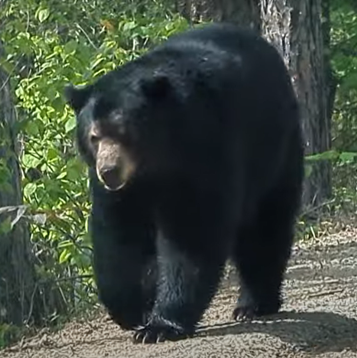

# Welcome

## World Quantum Day - April 14

- [World Quantum Day: Questions on Applied QC](https://github.com/denisecase/world-quantum-day-2024)

## MandArt

- [MandArt (App Store)](https://apps.apple.com/us/app/mandart/id6445924588?mt=12) - runs on MacOS (v12+) - _Released!_
- [MandArt-Docs](https://denisecase.github.io/MandArt-Docs/documentation/mandart/)
- [MandArt-Discoveries](https://github.com/denisecase/MandArt-Discoveries)
- [Color Cube](https://denisecase.github.io/color-cube/)

## MandArt Supporting

A SwiftUI app for creating custom art with the Mandelbrot set.

- [MandArt: source repo](https://github.com/brucehjohnson/MandArt) 
- [MandArt: my fork](https://github.com/denisecase/MandArt)
- [MandArt deploy](https://github.com/bruceranger/MandArt/)
- [MandArt-Docs: source repo](https://github.com/denisecase/MandArt-Docs)
- [MandMath (w/Julia)](https://github.com/denisecase/MandMath.jl) - Julia enables 150 - 1500+ decimal places
- [Color Cube: source repo](https://github.com/denisecase/color-cube)
- [GrandArt: source repo](https://github.com/denisecase/GrandArt) - explore exponenents beyond 2
- [MandArt3: source repo](https://github.com/denisecase/MandArt3) - explore MandArt with exponenent 3

## Machine Learning

- [Why Do We Square Residuals in Linear Regression?](https://github.com/denisecase/python-ml-linear-regression/)

## Professional Analytics

- [pro-analytics-level-1](https://github.com/denisecase/pro-analytics-level-1)

## Data Analytics Fundamentals

- [datafun-01-utils](https://github.com/denisecase/datafun-01-utils) - first reusable module w/stats
- [datafun-02-project-setup](https://github.com/denisecase/datafun-02-project-setup) - scripting project folders
- [datafun-03-analytics](https://github.com/denisecase/datafun-03-analytics) - fetch and write data, read and process it
- [datafun-04-spec](https://github.com/denisecase/datafun-04-spec)
- [datafun-05-spec](https://github.com/denisecase/datafun-05-spec)
- [datafun-06-spec](https://github.com/denisecase/datafun-06-spec)
- [datafun-01-textbook](https://github.com/denisecase/datafun-01-textbook) - try this after project 3 and virtual environments

## Continuous Intelligence and Interactive Analytics

- [cintel-01-spec](https://github.com/denisecase/cintel-01-spec)
- [cintel-02-spec](https://github.com/denisecase/cintel-02-spec)
- [cintel-03-spec](https://github.com/denisecase/cintel-03-spec)
- [cintel-04-spec](https://github.com/denisecase/cintel-04-spec)
- [cintel-05-spec](https://github.com/denisecase/cintel-05-spec)
- [cintel-06-spec](https://github.com/denisecase/cintel-06-spec)
- [cintel-07-spec](https://github.com/denisecase/cintel-07-spec)
- [fetch-data-weather](https://github.com/denisecase/fetch-data-weather)

## Streaming Data

- [streaming-01-getting-started](https://github.com/denisecase/streaming-01-getting-started)
- [streaming-02-multiple-processes](https://github.com/denisecase/streaming-02-multiple-processes)
- [streaming-03-rabbitmq](https://github.com/denisecase/streaming-03-rabbitmq)
- [streaming-04-multiple-consumers](https://github.com/denisecase/streaming-04-multiple-consumers)
- [email-alert](https://github.com/denisecase/email-alert)
- [text-alert](https://github.com/denisecase/text-alert)

## NW Diagnostics / Shared

- [nw-diagnostics-python](https://github.com/denisecase/nw-diagnostics-python)
- [datafun-00-python-virtual-env](https://github.com/denisecase/datafun-00-python-virtual-env)

## Continuous Intelligence and Interactive Analytics

- [pyshiny-tips-dashboard-express](https://github.com/denisecase/pyshiny-tips-dashboard-express)
- [pyshiny-penguins-dashboard-express](https://github.com/denisecase/pyshiny-penguins-dashboard-express)
- [pyshiny-penguins-dashboard-core](https://github.com/denisecase/pyshiny-penguins-dashboard-core)
- [cintel-01-getting-started](https://github.com/denisecase/cintel-01-getting-started)
- [cintel-02-app](https://github.com/denisecase/cintel-02-app)
- [cintel-03-data](https://github.com/denisecase/cintel-03-data)
- [cintel-04-reactive](https://github.com/denisecase/cintel-04-reactive)
- [cintel-05-live-updates](https://github.com/denisecase/cintel-05-live-updates)
- [cintel-stock-response](https://github.com/denisecase/cintel-stock-response)

## Northwoods

- [Meal Planner](https://denisecase.github.io/meal-planner/)
- [Select and Sort](https://denisecase.github.io/select-and-sort/)
- [Freeze Tracker](https://github.com/denisecase/freeze-tracker)
- [Northwoods](https://github.com/denisecase/Northwoods)
- [JFC](https://github.com/denisecase/johnson-family-cabin)

## Professional Data Analytics

Common documenation for professional data analytics fundamentals and more. 

- [Read The Docs](https://denisecase.github.io/datafun-central/)
- [datafun-central](https://github.com/denisecase/datafun-central) - source code for common docs

## NW Data Analytics

- [nw-network-data-analytics](https://github.com/denisecase/nw-network-data-analytics)
- [License Tracking](https://github.com/denisecase/license-tracking)

## Digital Forensics

- [digital-forensics-resources](https://github.com/denisecase/digital-forensics-resources)
- [386-site](https://github.com/denisecase/386-site)
- [dfir-hash-1](https://github.com/denisecase/dfir-hash-1)
- [dfir-hash-2](https://github.com/denisecase/dfir-hash-2)
- [dfir-pwsh-forensic-copy](https://github.com/denisecase/dfir-pwsh-forensic-copy)
- [dfir-pwsh-file-recovery](https://github.com/denisecase/dfir-pwsh-file-recovery)
- [df-mod6-mobile](https://github.com/denisecase/df-mod6-mobile)

## Alexa Skills

_Beginner-friendly - 
these skills are great for students to explore GitHub, open-source, and Alexa projects. 
Schedules can be updated with no coding experience - 
follow a link below and look in lambda/games.json to see how easy it is to update the schedule when a new season begins._ 

Skills to ask Alexa about upcoming local games in Ely Minnesota. [❄](https://www.wunderground.com/forecast/us/mn/ely)

- [TimberwolfTracker-BoysBasketball](https://github.com/denisecase/TimberwolfTracker-BoysBasketball)
- [TimberwolfTracker-GirlsBasketball](https://github.com/denisecase/TimberwolfTracker-GirlsBasketball)
- [TimberwolfTracker-GirlsVolleyball](https://github.com/denisecase/TimberwolfTracker-GirlsVolleyball)

## ArcDraw

- [ArcDraw source repo](https://github.com/brucehjohnson/ArcDraw) 
- [ArcDraw my fork](https://github.com/denisecase/ArcDraw) 

## Local Life

